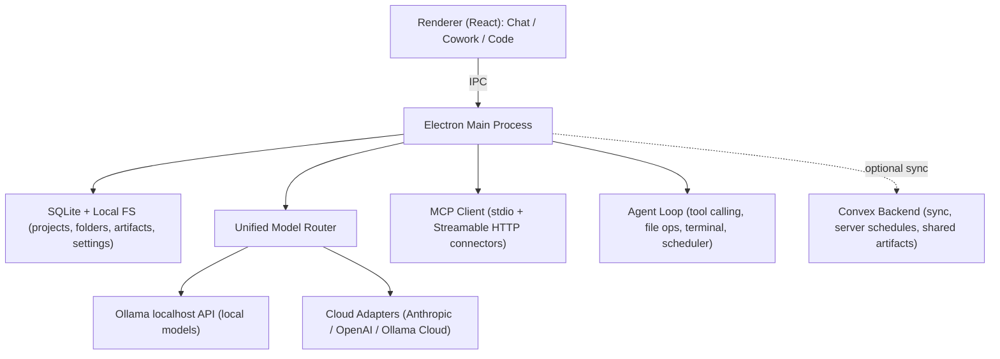
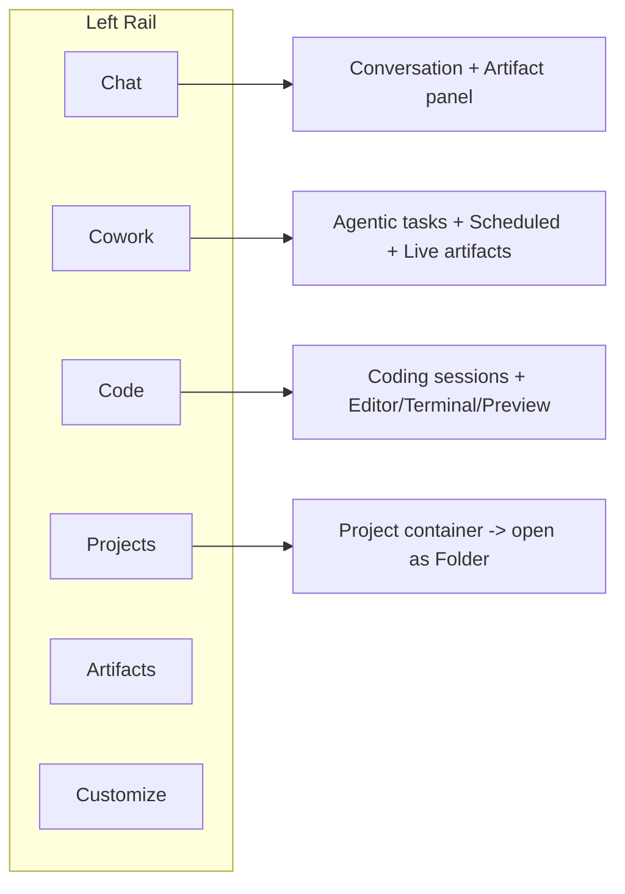
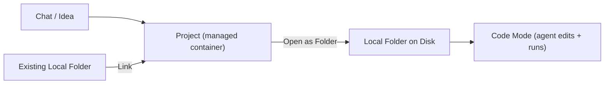

# Demerzel (Demi) - Product Requirements Document

> A local-first, Ollama-powered agent harness with a Claude-grade interface. Chat, Cowork, and Code in one app; switch between local models (Gemma, DeepSeek, Minimax, Nemotron, GLM/ZAI, Qwen) and cloud providers (Anthropic, OpenAI, Ollama Cloud) mid-conversation; turn a project into a real folder on disk and build software with a coding agent.

- Version: 0.1 (Draft)
- Date: June 2026
- Owner: Kwame
- Status: Pre-build specification

---

## 1. Overview & Vision

**Demerzel** (short name **Demi**) is a desktop agent harness that gives a Claude-Desktop-class experience to *locally run* models, while still letting users reach for frontier cloud models when they want to. It is named after Asimov's quietly capable companion-strategist: an assistant that does serious work in the background and brings results forward.

The core thesis: the polished, three-mode Claude experience (conversational chat, agentic "cowork," and an embedded coding agent) should not be locked to one vendor's cloud. Demi wraps **Ollama** so any model the user can pull runs inside the same first-class UI, and a unified model layer makes switching between a local `gemma4` and a cloud `claude-opus` as easy as Perplexity makes switching search models.

### One-line positioning
> "Ollama's local models with Claude's interface and Cursor's coding agent - on your machine, under your control."

### Why this exists
- **Ollama** is powerful but its UX is a CLI / minimal chat. There is no Projects, Artifacts, Cowork, scheduled agents, MCP connectors, or coding agent.
- **Claude Desktop** has the best-in-class UX (Chat / Cowork / Code, Artifacts, Connectors, Scheduled tasks, Design) but is cloud-only and single-vendor.
- **Cursor / Codex** nail the project-to-folder coding loop but are coding-first.
- Demi fuses these: Claude's information architecture, Cursor's coding loop, Perplexity's model fluidity, and Ollama's local-model freedom.

---

## 2. Goals & Non-Goals

### Goals
- G1. Run any Ollama-available model in a first-class chat UI with streaming, thinking traces, and tool calling.
- G2. Let users browse, pull (with live progress), inspect, and delete models from inside the app (an Ollama "Model Manager").
- G3. Switch models mid-conversation, including across local <-> cloud, carrying context forward.
- G4. Provide three modes mirroring Claude: **Chat**, **Cowork** (agentic + scheduled tasks), **Code** (coding agent).
- G5. Support the **Project -> Folder** flow: a project (a managed container) can be materialized to a real local directory the Code agent operates on.
- G6. Connect external tools/data via **MCP connectors** with a per-tool permission model.
- G7. Be **local-first**: everything works fully offline with local models; no account required.
- G8. Offer an **optional Convex backend** for users who want cross-device sync, server-run scheduled tasks, and shared artifacts.

### Non-Goals (v1)
- NG1. Building a custom inference engine (we wrap Ollama; a native llama.cpp engine is future work).
- NG2. Mobile apps (desktop first).
- NG3. Multi-user team collaboration / org management.
- NG4. Training or fine-tuning models in-app.
- NG5. A marketplace for connectors/skills (curated list only in v1).

---

## 3. Target Users

- **Local-AI enthusiasts / privacy-conscious devs** who already use Ollama and want a real UI.
- **Developers** who want a Cursor-like coding agent that can run on local models (no per-token cloud cost).
- **Power users / "vibe builders"** who want Claude-style Projects, Artifacts, and scheduled agents without vendor lock-in.
- **People on metered or air-gapped networks** who need offline capability with optional cloud bursting.

---

## 4. Platform & Tech Stack Decision

### Recommendation: Electron + Vite + React + TypeScript

**Why Electron (over Tauri / web-only):**
- **Parity with reference apps.** Claude Desktop, Cursor, and ChatGPT/Codex desktop are all Electron-class apps; the UX patterns we are matching are proven there.
- **First-class Node main process.** We must spawn/health-check the local **Ollama** process, launch **MCP stdio servers** as child processes, and use **node-pty** for the Code terminal. Node makes this straightforward.
- **Full filesystem access.** The Project -> Folder materialization, file tree, and code editing need unrestricted local FS access.
- **Richest UI ecosystem.** React + Tailwind + Radix + Monaco + xterm.js are all battle-tested in Electron.

**Tauri considered** (smaller binaries, Rust core, better memory) but rejected for v1 due to slower iteration velocity, a smaller plugin ecosystem for the integrations we need (pty, MCP stdio), and webview inconsistencies across platforms. Revisit post-1.0 if footprint matters.

### Proposed stack
- **Shell:** Electron (main + preload + renderer), context isolation on, IPC bridge.
- **Build:** Vite + electron-vite; TypeScript everywhere.
- **UI:** React 18, Tailwind CSS with design tokens (see `DESIGN_SYSTEM.md`), Radix UI primitives / shadcn-style components, Framer Motion for transitions, Lucide icons.
- **State:** Zustand for app state; TanStack Query for async/stream orchestration.
- **Local persistence:** SQLite via `better-sqlite3` (chats, messages, projects, settings, connector configs, schedules). Local filesystem for materialized **folders** (workspaces) and artifact files.
- **Secrets:** OS keychain via `keytar` for cloud API keys (never in SQLite/plaintext).
- **Local models:** Ollama HTTP client (see Section 6).
- **Cloud models:** provider adapters behind a unified interface (Section 6).
- **Connectors:** `@modelcontextprotocol/sdk` (v1.x) MCP client over stdio + Streamable HTTP.
- **Code mode:** Monaco editor, xterm.js + node-pty terminal, chokidar file watching, a diff viewer, and an embedded preview (BrowserView/iframe) for dev servers.
- **Optional backend:** **Convex** (see Section 12).

### High-level architecture

---

## 5. Information Architecture (Three Modes)

The left rail holds three top-level modes (mirroring Claude Desktop's Chat / Cowork / Code), plus persistent nav: New, Projects, Artifacts, Customize, and the account/footer. A global model switcher lives in every composer.

### 5.1 Chat mode
- Conversational interface with streaming responses and reasoning ("thinking") display toggle.
- Composer with: model switcher, reasoning-effort selector (e.g. Low/Medium/High), attachments (files, images for vision models), and quick actions (Write / Learn / From Folder).
- **Artifacts side-panel** for generated HTML/markdown/code/docs, with live preview, copy, download-all, and "open in browser."
- Conversations can be promoted to a **Project** at any time.

### 5.2 Cowork mode
- Agentic task runner: "knock something off your list." User describes a task; Demi plans and executes with tools.
- **Scheduled / recurring tasks** (e.g. "every Monday at 9am"): each task has instructions, run history (success/warn/fail), and a **Keep awake** option (tasks run while the machine is awake; server-run if Convex is enabled).
- **Live artifacts:** long-lived outputs (dashboards, docs) the agent updates across runs.
- "Work in a project" selector so a task operates within a project's context/folder.
- **Dispatch (Beta-style):** fire a one-off agent task into the background and get notified on completion.

### 5.3 Code mode
- Coding-agent sessions (Cursor/Codex-like): describe a task, the agent reads/edits files, runs commands, and previews results.
- Layout: file tree + Monaco editor + integrated terminal (node-pty) + preview pane for dev servers.
- A session is bound to a **folder** (a materialized project or any opened local directory).
- **Usage dashboard** on the Code home: sessions, messages, total tokens, active-days heatmap, current/longest streak, peak hour, favorite model (local + cloud usage tracked separately).
- **Routines:** reusable, parameterized coding workflows the user can re-run.

---

## 6. Model System (Core Differentiator)

### 6.1 Unified model registry
A single in-app catalog merges:
- **Local models** discovered via Ollama `/api/tags` and `/api/ps` (loaded state).
- **Cloud provider models** declared by adapters (Anthropic, OpenAI, etc.).
- **Ollama Cloud** models (the `:cloud` tags) for users who want hosted Ollama inference.

Each registry entry carries normalized metadata: id, display name, provider, parameter size, context window, quantization (local), capabilities (`vision`, `tools`, `thinking`), approximate VRAM/RAM need, and install state (installed / available / loaded).

### 6.2 In-composer model switcher
- Mirrors Claude's `Opus 4.8  High` chip: pick a **model** and a **reasoning effort**.
- Grouped by Local / Cloud, with capability badges and a search box.
- Shows VRAM warnings for local models that may not fit the user's hardware.

### 6.3 Mid-conversation switching (Perplexity-style)
- The user can change models on any turn. Conversation history is preserved and re-fed to the new model (with provider-specific message normalization).
- Per-message provenance: every assistant message records which model produced it (badge + tooltip).
- Graceful capability handling: if switching to a non-vision model after an image was sent, Demi warns and substitutes a text description placeholder.

### 6.4 Model Manager (the Ollama-like surface)
- **Browse catalog:** curated grid of popular 2026 models with sizes/capabilities, e.g.:
  - `gemma4` (26B / 31B; vision + thinking + tools; ~128K ctx)
  - `deepseek-v3.2`, `deepseek-v4-pro` (reasoning, MoE)
  - `minimax-m2.5`, `minimax-m2.7` (~200B MoE; agentic/coding)
  - `nemotron-3-nano` (4B-30B; up to ~1M ctx) and `nemotron-3-super`
  - `glm-5` / `glm-5.1` (ZAI; reasoning)
  - `qwen3.5`, `qwen3-coder-next`, `kimi-k2.5`
- **Pull with live progress:** stream `/api/pull` ndjson, show layer/byte progress and ETA.
- **Inspect:** `/api/show` details (license, params, template, modelfile).
- **Manage:** delete (`/api/delete`), copy, view currently loaded (`/api/ps`) with unload control.
- **Hardware fit:** display estimated VRAM at Q4_K_M and flag models that exceed detected GPU/RAM.

### 6.5 Inference layer (provider abstraction)
A unified `ModelProvider` interface so the agent loop is provider-agnostic:
- `OllamaProvider` -> `POST /api/chat` (streaming ndjson; reads `message.content`, `message.thinking`, and `message.tool_calls`).
- `AnthropicProvider`, `OpenAIProvider` -> respective streaming chat APIs, normalized to the same event shape (text delta / thinking delta / tool_call / done).
- **Tool calling loop:** Ollama returns `tool_calls` for the host to execute; Demi runs the tool (file op, terminal, MCP, web fetch), appends a `tool` role message, and continues - identical pattern across providers.

### 6.6 Ollama base URLs & connection
- Default local base URL: `http://localhost:11434/api` (configurable for remote Ollama hosts).
- App detects whether Ollama is installed/running; if not, surfaces a guided install/start flow.
- Ollama Cloud base URL `https://ollama.com/api` supported for `:cloud` tags.

---

## 7. Projects & the Project -> Folder Flow (Codex-inspired)

### Concepts
- **Project:** a managed container (lives in SQLite + an app-managed directory). Holds chats, custom instructions, reference files, and configuration. Conceptually the "cloud-like" workspace.
- **Folder:** a real directory on the user's disk that the Code agent operates on (git repo, source tree, etc.). Conceptually "local storage."

### The flow
1. A chat/idea becomes a **Project** (promote from Chat or create new).
2. The project accumulates context (instructions, files, generated artifacts).
3. **Open/Export as Folder:** materialize the project to a chosen local directory - generated files, artifacts, and a `demi.project.json` manifest are written to disk.
4. **Code mode** binds to that folder; edits flow both ways (the project tracks the folder path).
5. Optionally **link an existing folder** to a project (reverse direction).

### Sync rules
- Project metadata (instructions, chat history) stays in SQLite.
- The folder is the source of truth for code files once materialized.
- A manifest (`demi.project.json`) records the binding, model defaults, and connector config so a folder can be re-opened as a project later.

---

## 8. Artifacts System

- Detects fenced artifacts (HTML, markdown, React/code, SVG, mermaid) in model output.
- Renders in a side-panel with: live preview, source/preview toggle, copy, download (single + "download all"), and "open in default browser."
- Artifacts persist per-conversation and per-project; can be promoted to **Live artifacts** in Cowork (updated across scheduled runs).
- Versioning: each regeneration creates a new version with quick diff/restore.

---

## 9. Connectors / MCP

- Built on the **Model Context Protocol**; Demi acts as an MCP **client**.
- **Transports:** stdio (spawn local server processes) and Streamable HTTP (remote servers). Targets MCP TS SDK v1.x (production-recommended).
- **Add a connector:** via a config form or importing a standard `mcpServers` JSON block (same shape as Claude Desktop's config), e.g. filesystem, git, github, postgres, fetch, memory.
- **Tool permission model** (mirrors the Airtable connector screenshot): per-tool setting of **Allow / Ask (needs approval) / Deny**, with read-only tools grouped and surfaced separately. Default to "Ask" for any state-changing tool.
- Tools discovered via `tools/list`, invoked via `tools/call`; results fed back into the agent loop.
- Resources (`resources/*`) can be browsed and attached into context.

---

## 10. Agent Capabilities

- **Tool calling** across all providers (unified loop, Section 6.5).
- **Built-in tools:** file read/write/search, terminal/command execution (node-pty), web fetch/search, artifact write, and project/folder operations.
- **MCP tools:** any connected server's tools (gated by permissions).
- **Scheduled tasks (Cowork):** cron-like schedules with instructions, run history, and notifications. Local schedules run while the machine is awake (with a Keep-awake toggle); server-run schedules require the optional Convex backend.
- **Safety:** destructive operations (delete, overwrite, shell) require confirmation unless the user has granted standing permission for that tool/scope.

---

## 11. Settings & Customize

- **Providers:** add/remove cloud providers and API keys (stored in OS keychain), set default models per mode.
- **Ollama:** base URL, auto-start toggle, model storage location, GPU/CPU info display.
- **Appearance:** light/dark/system theme, accent selection (see Design System), density.
- **Privacy:** telemetry off by default; explicit "local-only" mode that disables all cloud calls.
- **Skills / Routines:** manage reusable instructions and coding routines.
- **Connectors:** manage MCP servers and per-tool permissions.

---

## 12. Optional Backend (Convex)

Demi is local-first by default; **Convex is an optional, opt-in backend** for users who sign in. Convex is well-suited here because of its reactive queries, scheduled functions, and file storage.

When enabled, Convex provides:
- **Cross-device sync** of projects, chats, instructions, and settings (NOT model weights; those stay local with Ollama).
- **Server-run scheduled tasks** (Convex scheduled functions / crons) so Cowork tasks can run even when the desktop is asleep - using cloud providers for inference (local models still require the local machine).
- **Shared artifacts** via Convex file storage with shareable links.
- **Auth** for the above (Convex Auth or a provider like Clerk).

Design constraints:
- The app must remain fully functional with Convex disabled.
- A sync adapter abstracts persistence so SQLite (local) and Convex (cloud) implement the same interface; conflict resolution is last-write-wins with per-entity version stamps in v1.
- Secrets/API keys are never synced; they remain in the local keychain.

> Note: Convex code must follow `convex/_generated/ai/guidelines.md` once the backend is scaffolded.

---

## 13. Data Model (Local)

SQLite tables (local-first source of truth):
- `projects` (id, name, instructions, folder_path?, default_model, created_at, updated_at)
- `folders` (id, project_id?, path, kind, last_opened_at)
- `chats` (id, project_id?, mode, title, created_at, updated_at)
- `messages` (id, chat_id, role, content, thinking?, model_id, tool_calls?, created_at)
- `artifacts` (id, chat_id?, project_id?, type, title, content, version, created_at)
- `models` (id, provider, name, params, context, capabilities, install_state, size_bytes)
- `connectors` (id, name, transport, config_json, enabled)
- `tool_permissions` (id, connector_id, tool_name, policy) -- allow | ask | deny
- `schedules` (id, task_name, cron, instructions, project_id?, keep_awake, last_run_at, status)
- `runs` (id, schedule_id?, started_at, finished_at, status, log)
- `settings` (key, value)

Local filesystem layout (app data dir):
- `/projects/<id>/` managed project files + `demi.project.json`
- `/artifacts/<id>/` exported artifact files
- `/logs/` agent + run logs

API keys live in the OS keychain, keyed by provider.

---

## 14. Privacy & Security

- **Local-first, offline-capable:** with only local models, no data leaves the machine.
- **Secrets in keychain:** cloud API keys never stored in SQLite or synced.
- **MCP sandboxing:** stdio servers run as child processes with explicit, per-tool permissions; default-deny for state-changing tools until approved.
- **Code agent guardrails:** confirmation prompts for shell/destructive ops; folder-scoped file access.
- **Telemetry:** off by default; if added later, must be opt-in and anonymized.

---

## 15. Roadmap (Phased)

- **Phase 0 - Foundation:** Electron + Vite + React shell, design tokens, SQLite, settings, keychain, Ollama detection.
- **Phase 1 - Chat + Models (MVP):** Chat mode, Ollama provider, streaming + thinking, in-composer model switcher, mid-chat switching, Model Manager (pull/inspect/delete), cloud provider adapters.
- **Phase 2 - Artifacts + Projects:** artifact panel + persistence, Projects, Project -> Folder materialization.
- **Phase 3 - Code mode:** file tree + Monaco + terminal + preview, coding agent loop, usage dashboard, routines.
- **Phase 4 - Cowork + Connectors:** agentic tasks, scheduled tasks (local), MCP connectors + permission model, live artifacts.
- **Phase 5 - Optional Convex backend:** auth, sync, server-run schedules, shared artifacts.
- **Phase 6 - Polish:** vision attachments, advanced hardware-fit guidance, accessibility pass, packaging/auto-update.

---

## 16. Open Questions & Future Work

- Native inference engine (llama.cpp/GGUF) to drop the hard Ollama dependency.
- LM Studio / other local runtimes as alternative engines behind the same abstraction.
- Connector/skill marketplace.
- Team/multi-user collaboration on top of Convex.
- Mobile companion (read/triage, trigger tasks).

---

## Appendix A - Ollama API Reference (used by the integration)

- Base URL: `http://localhost:11434/api` (local), `https://ollama.com/api` (cloud `:cloud` tags).
- `GET /api/tags` - list installed models.
- `GET /api/ps` - list loaded (in-memory) models.
- `POST /api/show` - model details (params, template, license).
- `POST /api/pull` - download a model; ndjson streaming progress (`status`, `completed`, `total`).
- `POST /api/chat` - multi-turn chat; streaming ndjson; chunks expose `message.content`, `message.thinking`, `message.tool_calls`. Host executes tools and posts back a `role: "tool"` message.
- `POST /api/generate` - single-turn generation.
- `POST /api/embeddings` - embeddings.
- `DELETE /api/delete`, `POST /api/copy`, `POST /api/create`, `GET /api/version`.
- Streaming is on by default over REST; disable with `"stream": false`.

## Appendix B - Reference Apps (grounding)

- **Claude Desktop:** Chat / Cowork / Code modes, Projects, Artifacts, Connectors, Scheduled tasks, Design - the primary UX grounding.
- **Ollama:** local model pull/run/list - the local runtime and Model Manager grounding.
- **Cursor / Codex (ChatGPT desktop):** project-to-folder coding loop and connectors.
- **Perplexity:** fluid in-chat model switching.
